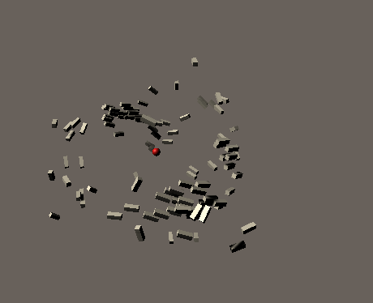
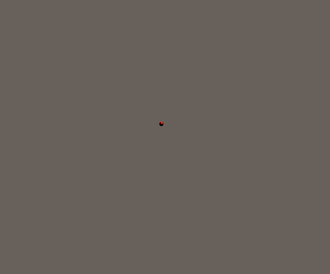
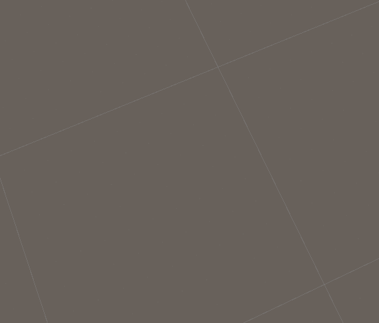
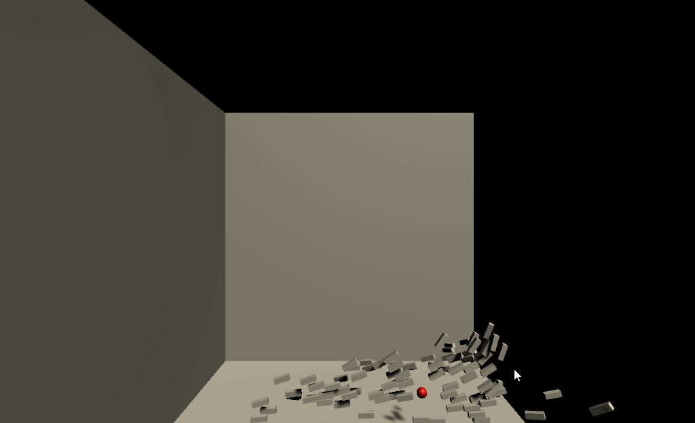

# Boids-Simulation
This project simulates the flocking behavior of birds. It uses Unity3d engine to implement the Boids algorithm.

Boids algorithm is an emergent-behavior approach that follows three main rules:

1) **Cohesion** force is applied to local flockmates to steer towards their average position (center of mass) => pulling them toward each other.
2) **Separation** force is applied to local flockmates to avoid crowding => pushing each other away.
3) **Alignment** force is applied to local flockmates to steer them toward the average direction => travelling in the same direction.

| Cohesion | Separation | Alignment |
| :-----: | :-------: | :-------: |
|  |  |  |

`The red sphere in the images represents the average position (center of mass) of the entire flock.`

Additional rules can be applied to the simulation, such as collision avoidance.

| Collision Avoidance |
| :-----: |
|  |

# Demo

We created a demo that simulates a flock of 50 birds.
A complete demo can be found on [https://omaddam.github.io/Boids-Simulation/](https://omaddam.github.io/Boids-Simulation/).